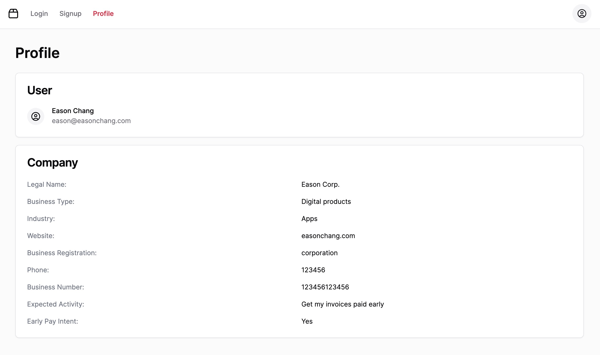

# Quickly Auth

A demo project to integrate Quickly auth API.

## Demo

I have deployed this project to Vercel, you can check it out at:

https://quickly-auth.vercel.app/

## Scripts

### Pre-requisites

- [Node.js](https://nodejs.org/en/) (v21 or higher)
- [pnpm](https://pnpm.io/) (v9 or higher)

### Installation

```bash
pnpm install
```

### Run the project

```bash
pnpm dev
```

And it will be served at `http://localhost:3000`.

### Test

```bash
pnpm test
# or in watch mode
pnpm test:watch
```

It will run unit & snapshot tests on all components.

### Lint

```bash
# Fix eslint and prettier errors for all JS files
pnpm lint:fix
# Fix prettier errors for all other files (css, md, json, etc.)
pnpm format:fix
```

## Tech Stack

- [Next.js 14](https://nextjs.org/) with app router
- [Tailwind CSS](https://tailwindcss.com/) for styling
- [Shadow/UI](https://ui.shadcn.com/) for ready-to-use UI components
- [Fetch](https://developer.mozilla.org/en-US/docs/Web/API/Fetch_API) for API requests
- [Jotai](https://jotai.org/) for state management
- [React Hook Form](https://react-hook-form.com/) for form handling
- [Jest](https://jestjs.io/), [React Testing Library](https://testing-library.com/docs/react-testing-library/intro/) for unit & snapshot tests
- [ESLint](https://eslint.org/) with [Prettier](https://prettier.io/) for linting & formatting

## Features

This project contains 3 pages:

### Profile page (index page, `/`)

Shows user profile and company information:



If the user is not logged in, it will show a 401 unauthorized message:


### Login page (`/login`)

Users can log in with email and password:


The form validates whether the email format is correct.

Users can logout by clicking the logout button on the top right corner.

The user auth token is stored in **Local Storage**.


### Sign Up page (`/signup`)

Users can sign up:


The form validates whether the email format is correct, the password is at least 6 characters long, and the confirmed email and password are the same.

## Folder structure in `/src` folder

- `/app`: Next.js app router for pages
- `/atoms`: Jotai atoms for global states
- `/components`: React components with unit tests
- `/components/ui`: Shadcn/UI components installed via npm
- `/hooks`: Custom hooks
- `/lib`: Utility functions for Shadcn/UI components
- `/services`: API services, actual API calls
- `/types`: TypeScript types
